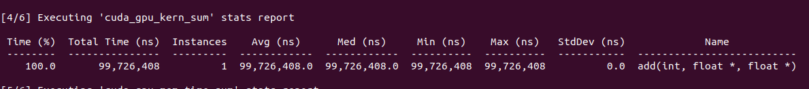
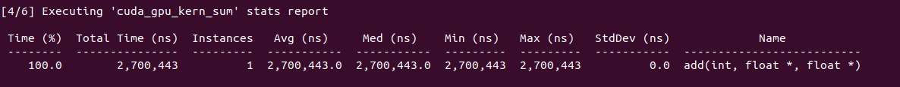
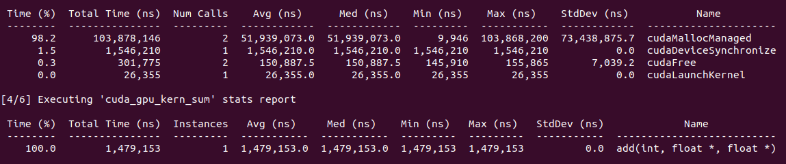
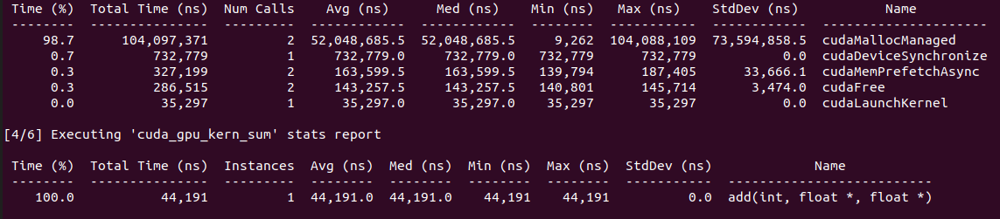
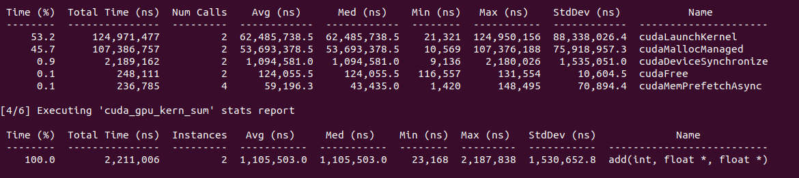

# GPU Add

The goal of this repository is to experiment/learn with CUDA and GPU parellization.

We will run comparisons with the GPU and CPU to ilustarte the performacne gain. Obvusly the GPU will be sevral times faster than CPU.

Using this guide [link](https://developer.nvidia.com/blog/even-easier-introduction-cuda/)

## Running the CPU program

1. run this script: `runCPU.sh`

## Experimetns

### Experiment 1 GPU

Ran the add kernal with this code: `add.cu` one thread on an RTX3060. 
Results:

Kernal ran for 99.726408M  nano sec

### Experiment 2 GPU

Will run with more threads by changing the `add<<<1,256>>>(N,x,y);` You can only increase it in multiple of 32 acording to nvidia. 

We will split the computation using `threadIdx` and `blockDim`
See `add2.cu`

Results:

Kernal ran for 2.7M  nano sec a 36x increase!

### Experiment 3 GPU

Lets try making out the number of threads we can use. To take it to the limist of the rtx3060

RTX-3060 has 3584 CUDA cores and runs on the Ampere architecture
Looked online for the whitepaper for the 3060 and couldn't find it I did finde the 3070 [link](https://www.nvidia.com/content/PDF/nvidia-ampere-ga-102-gpu-architecture-whitepaper-v2.pdf)

Based on thsi the RTX 3070 FE has 82 SMs the 3060 should probobly have something lower. I did finde out that the RTX 3060 uses GA106 [link](https://videocardz.com/newz/nvidia-launches-geforce-rtx-3060-with-12gb-memory-and-ga106-gpu) it uses 30 SMs but appernetly only 28 enabled. 

Will use `28` SMs.
From the NVIDIA page an RTX 3060 has `3584` cuda cores.

Results:

Intrestingly  it did not increase that much. It seem like memory was the bottleneck. Its like the memory is not cached. Fetching memory from somewhre else is extreamly expensive at least from what I learned in computer architecture. 

### Experiment 4 GPU

We can prefetch the memory using `cudaMemPrefetchAsync`

Result:

It reduced the time significantly. 
This is a `2,256x` increase form the first implementation
I do have 2 GPUs I am thinking I should be able to aproximetly half this also. 

### Experimetn 5 GPU

I will try excecuting across 2 GPUs
It looks like it got worse. I'm guessing the coordination overhead for this was too large for the task.

