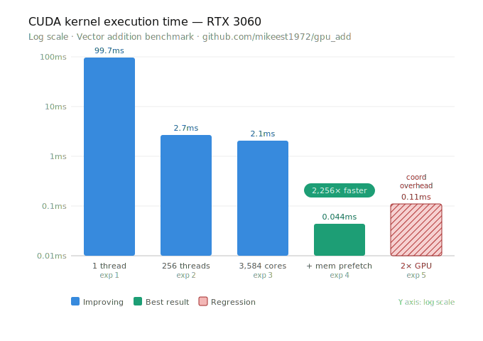

# GPU Add

The goal of this repository is to experiment/learn with CUDA and GPU parallelization.

We will run comparisons with the GPU and CPU to illustrate the performance gain. Obviously the GPU will be several times faster than CPU.

Using this guide [link](https://developer.nvidia.com/blog/even-easier-introduction-cuda/)

## TLDR

## Running the CPU program

1. run this script: `runCPU.sh`

## Experiments

### Experiment 1 GPU

Ran the add kernal with this code: `add.cu` one thread on an RTX3060. 
Results:

Kernel ran for 99.726408M  nano sec

### Experiment 2 GPU

Will run with more threads by changing the `add<<<1,256>>>(N,x,y);` You can only increase it in multiple of 32 according to nvidia. 

We will split the computation using `threadIdx` and `blockDim`
See `add2.cu`

Results:

Kernel ran for 2.7M  nano sec a 36x increase!

### Experiment 3 GPU

Let's try maxing out the number of threads we can use. To take it to the limits of the rtx3060

RTX-3060 has 3584 CUDA cores and runs on the Ampere architecture
Looked online for the whitepaper for the 3060 and couldn't find it I did find the 3070 [link](https://www.nvidia.com/content/PDF/nvidia-ampere-ga-102-gpu-architecture-whitepaper-v2.pdf)

Based on this the RTX 3070 FE has 82 SMs the 3060 should probably have something lower. I did find out that the RTX 3060 uses GA106 [link](https://videocardz.com/newz/nvidia-launches-geforce-rtx-3060-with-12gb-memory-and-ga106-gpu) it uses 30 SMs but apparently only 28 enabled. 

Will use `28` SMs.
From the NVIDIA page an RTX 3060 has `3584` cuda cores.
See `add3.cu`

Results:

Interestingly it did not increase that much. It seems like memory was the bottleneck. It's like the memory is not cached. Fetching memory from somewhere else is extremely expensive at least from what I learned in computer architecture. 

### Experiment 4 GPU

We can prefetch the memory using `cudaMemPrefetchAsync`
See `add4.cu`

Result:

It reduced the time significantly. 
This is a `2,256x` increase from the first implementation
I do have 2 GPUs I am thinking I should be able to approximately halve this also. 

### Experiment 5 GPU

I will try executing across 2 GPUs
See `add5.cu`
It looks like it got worse. I'm guessing the coordination overhead for this was too large for the task.

