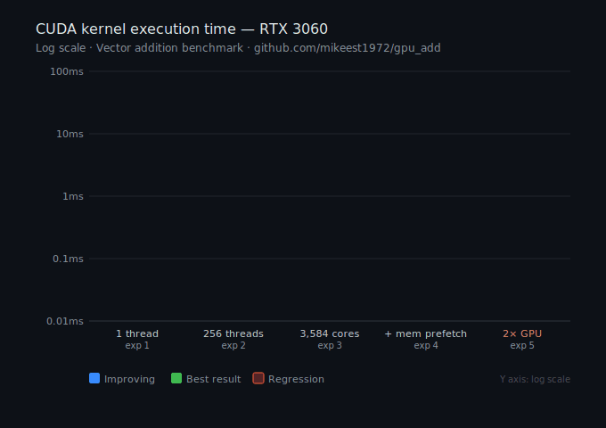

# GPU Acceleration Experiments

A collection of CUDA experiments exploring GPU parallelization and performance. Each experiment lives in its own directory with source code, build artifacts, and detailed notes.

## Motivation

Learning CUDA by running hands-on comparisons between CPU and GPU implementations, measuring speedups, and pushing hardware limits on an RTX 3060.

## Experiments

### 1. [gpu_add](./gpu_add/README.md)

Parallel vector addition — iterative optimization from 1 thread to multi-GPU, achieving a **2,256x** speedup.



---

### 2. gpu_matmul *(coming soon)*

Matrix multiplication — naive vs shared memory tiling vs cuBLAS.

## Hardware

- **GPU:** NVIDIA RTX 3060 (GA106, 28 SMs, 3584 CUDA cores) x2
- **Architecture:** Ampere

## Structure

```
gpu_acceleration/
├── gpu_add/        # Vector addition experiments
├── gpu_matmul/     # Matrix multiplication experiments (WIP)
└── ...
```

## References

- [An Even Easier Introduction to CUDA](https://developer.nvidia.com/blog/even-easier-introduction-cuda/)
- [NVIDIA Ampere GA102 Architecture Whitepaper](https://www.nvidia.com/content/PDF/nvidia-ampere-ga-102-gpu-architecture-whitepaper-v2.pdf)
